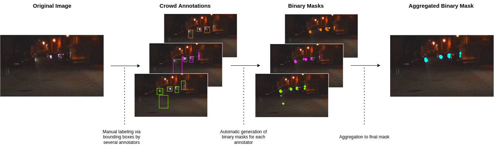

# Detecting Oncoming Vehicles at Night in Urban Scenarios - An Annotation Proof-Of-Concept

This repository will soon contain the code for paper "Detecting Oncoming Vehicles at Night in Urban Scenarios - An Annotation Proof-Of-Concept". The code is currently cleaned up and published very soon.

## Dataset

The data is currently being anonymized and published on [kaggle](https://www.kaggle.com/) very soon.